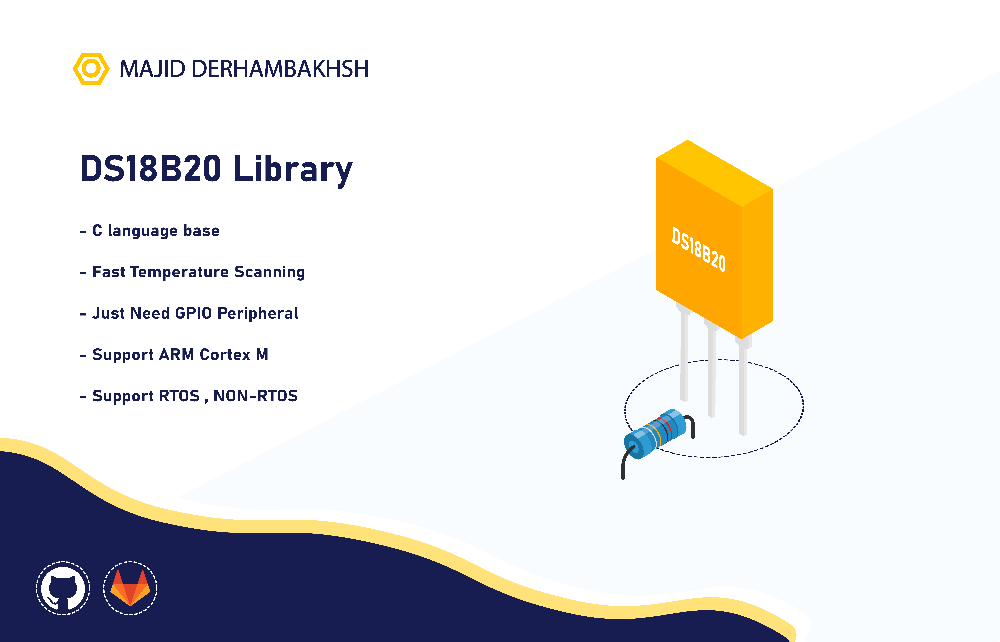

# DS18B20
DS18B20 library for using in AVR - ARM Cortex M

### Version : 0.0.0

- #### Type : Embedded Software.

- #### Support :  
               - ARM STM32 series  

- #### Program Language : C/C++

- #### Properties :

### Initialization and de-initialization functions:

### DS18B20 operation functions:
```c++
float DS18B20_GetTemperature(void);
``` 

### Macros:
```c++
#define _DS18B20_GPIO          GPIOx
#define _DS18B20_PIN           GPIO_PIN_x

#define _DS18B20_REINIT_DELAY  1000U

#define Delay_MS(tim)          HAL_Delay((tim))
#define Delay_US(tim)          HAL_Delay((tim))

#define STM32F1
``` 

## How to use this library

### The DS18B20 library can be used as follows:
1.1  DS18B20 configuration in the ds18b20_conf.h header, for example:  
         
```c++
   /* --- Required Driver.Library---- */
   /* For AVR */
   //#include "x.h"

   /* For STM32 */
   #include "TimDelay.h"

   /* -------- Configuration -------- */
   /* GPIO */
   #define _DS18B20_GPIO          GPIOA
   #define _DS18B20_PIN           GPIO_PIN_1

   #define _DS18B20_REINIT_DELAY  1000U

   /* Delay Functions */
   #define Delay_MS(tim)          HAL_Delay((tim))
   #define Delay_US(tim)          TIMER_Delay((tim))

   /* Microcontroller Series */
   #define STM32F1     
```  
      
2.1  Initialize:  

3.1  Using DS18B20 operation functions, for example:  
```c++
   int main()
   {
      float temp = 0;
      char msg[20] = {0};
      
      while (1)
      {
        
        temp = DS18B20_GetTemperature();
        
        sprintf(msg, "Temp : %5.2f", temp);
        HAL_UART_Transmit(&uart1, (uint8_t *)msg, strlen(msg));
        
      }
   }
       
```

#### Developer: Majid Derhambakhsh
